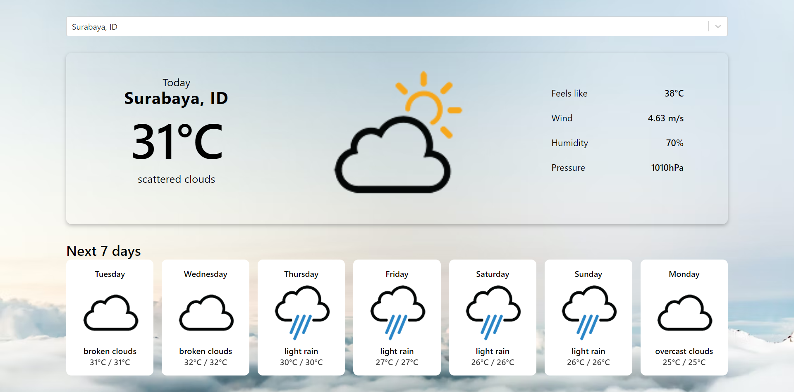
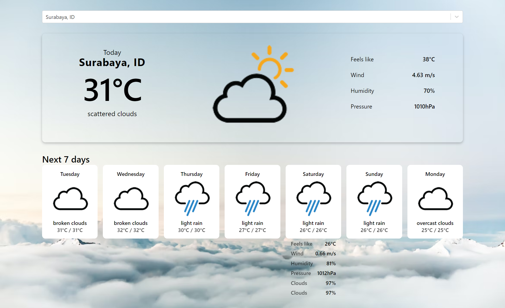

# Weather App using React JS
This project is a weather app built with React JS framework. I created this project as an exercise to learn how to make API calls in react application.

## Table of contents

- [Overview](#overview)
  - [The challenge](#the-challenge)
  - [Screenshot](#screenshot)
  - [Links](#links)
- [My process](#my-process)
  - [Built with](#built-with)
  - [What I learned](#what-i-learned)
  - [Useful resources](#useful-resources)
- [Author](#author)

## Overview

### The challenge

- Make API calls from GeoDB API and OpenWeather API

### Screenshot

### Links
- [Live Site URL](https://weather-app-reactjs-three.vercel.app/)

## My process

### Built with

- Semantic HTML5 markup
- CSS custom properties
- Flexbox
- CSS Grid
- [React JS](https://reactjs.org/) - JS library
- [react-accessible-accordion](https://www.npmjs.com/package/react-accessible-accordion) - JS library
- [OpenWeather API](https://openweathermap.org/)
- [GeoDB Cities API](https://rapidapi.com/wirefreethought/api/geodb-cities/)

### What I learned

I learned how to make API calls in react and display a clickable forecast details using react-accessible-accordion library 

### Useful resources
- [Youtube tutorial on weather app by freecodecamp](https://www.youtube.com/watch?v=Reny0cTTv24&list=PLX3rE0SL_PjE3vQB36SP-gjFypp_oZKbi&index=28) - This tutorial helps me to learn about API calls in React JS as a beginner

## Author

- Github - [Shabrina Putri](https://github.com/shabrina12/)
- Instagram - [@shabputri_](https://www.instagram.com/shabputri_/)
